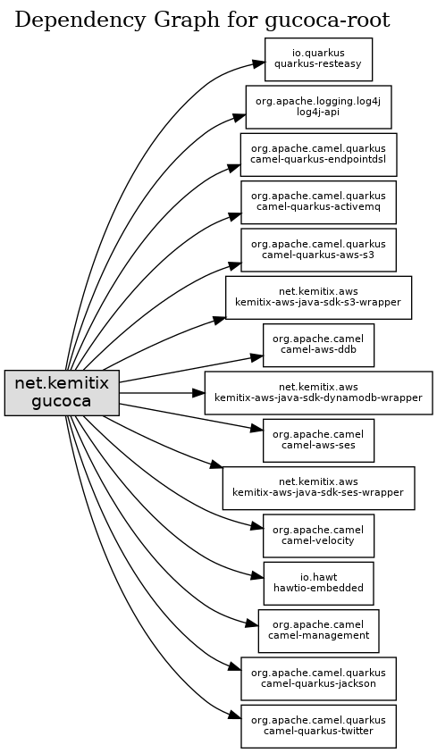

# gucoca
Posts stories from the archives at random to Twitter for Cossmass Infinities

## Dependencies



## Organisation

Uses Apache Camel with CDI.

## Configuration

Loads configuration form `$HOME/.config.gucoca.json`.

e.g.:

```json
{
  "startFrequencySeconds": 3600,
  "percentChanceToPost": 1,
  "awsRegion": "eu-west-2",
  "s3BucketName": "...",
  "s3BucketPrefix": "...",
  "storyFilename": "gucoca.json",
  "ddbTableName": "GucocaBroadcastHistory",
  "twitterDelayMillis": 21600000,
  "twitterApiKey":  "...",
  "twitterApiSecretKey": "...",
  "twitterAccessToken": "...",
  "twitterAccessTokenSecret": "...",
  "noRepeatDays": 60,
  "notificationRecipient": "recipient@example.net",
  "emailSender": "noreply@example.net"
}
```
